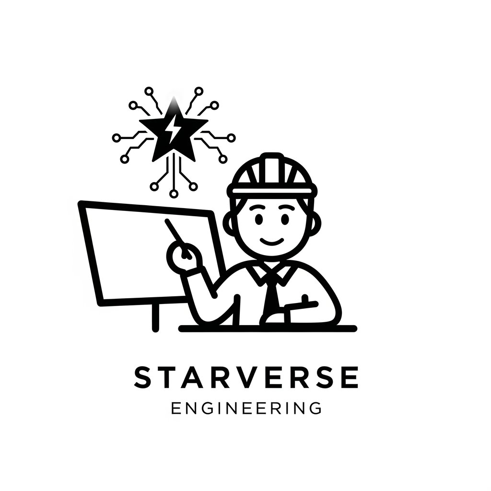
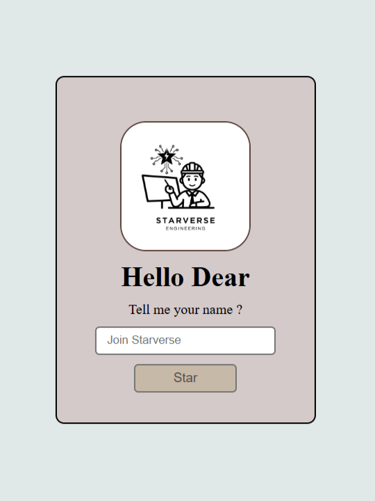
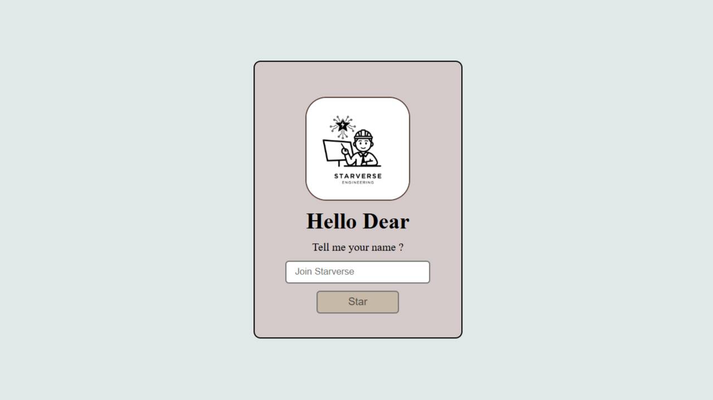
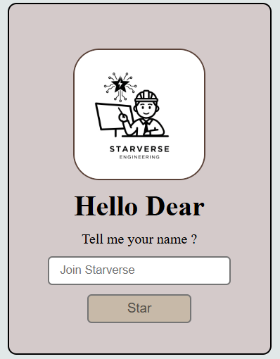

# ⭐ Star-Name - Interactive PWA Experience

<div align="center">



**Join the Starverse Journey** ✨🌟

A stunning Progressive Web App that creates personalized star names with offline support, seamless interactivity, and installable app features.

[](LICENSE)
[](manifest.json)
[](https://html.spec.whatwg.org/)
[](https://www.w3.org/Style/CSS/)
[](https://www.ecma-international.org/publications-and-standards/standards/ecma-262/)

</div>

---

## 📚 Table of Contents

- [Overview](#overview)
- [✨ Features](#-features)
- [🧠 PWA Capabilities](#-pwa-capabilities)
- [🛠️ Technologies Used](#️-technologies-used)
- [📁 Project Structure](#-project-structure)
- [🚀 Getting Started](#-getting-started)
- [💻 How to Use](#-how-to-use)
- [📱 Installation Guide (PWA)](#-installation-guide-pwa)
- [📸 Screenshots](#-screenshots)
- [🔧 Development](#-development)
- [📖 File Descriptions](#-file-descriptions)
- [🤝 Contributing](#-contributing)
- [📝 License](#-license)
- [👨‍💻 Author](#-author)

---

## Overview

**Star-Name** is a cutting-edge Progressive Web Application designed to deliver an engaging, interactive experience where users can create personalized star names. Built with vanilla JavaScript and modern web standards, this project showcases best practices in PWA development, responsive design, and user interface optimization.

Whether you're building on desktop or mobile, Star-Name works seamlessly online and offline with native app capabilities!

---

## ✨ Features

| Feature | Description |
|---------|-------------|
| 🎨 **Modern UI** | Clean, centered card layout with smooth animations |
| 🎯 **Interactive Experience** | Real-time personalized welcome messages |
| 📱 **Fully Responsive** | Optimized for all device sizes using Flexbox |
| ⚡ **Smooth Animations** | Hover effects and transitions for enhanced UX |
| 🖼️ **Rich Media** | Professionally styled logo with visual polish |
| 🌙 **Modern Styling** | Contemporary design with soft colors and shadows |
| 📦 **Installable** | Works like a native app on your device |
| 🔌 **Offline Support** | Full functionality without internet connection |

---

## 🧠 PWA Capabilities

This project implements **all modern PWA standards** for a native-like experience:

| Capability | Benefit |
|-----------|---------|
| 📥 **Add to Home Screen** | Install directly to your device home screen |
| 🌐 **Offline First** | Works seamlessly without internet after first load |
| ⚙️ **Service Worker** | Intelligent caching and performance optimization |
| 📋 **Web App Manifest** | Defines app identity, colors, and appearance |
| 🖥️ **Standalone Mode** | Runs as a standalone app (no browser UI) |
| 🔔 **App-like Feel** | Native gesture support and immersive experience |

---

## 🛠️ Technologies Used

```
Frontend Stack
├── HTML5           - Semantic structure & meta tags
├── CSS3            - Layout, animations & responsive design
├── JavaScript      - Interactivity & DOM manipulation
├── Service Workers - Offline caching & performance
└── Web App Manifest- PWA configuration & branding
```

- **Vanilla JS** - No frameworks, pure JavaScript for lightweight performance
- **Flexbox Layout** - Modern responsive layout without grid complexity
- **CSS3 Animations** - Smooth transitions and hover effects
- **PWA Standards** - Latest W3C PWA specifications

---

## 📁 Project Structure

```
Star-Name/
│
├── 📄 index.html              # Main HTML entry point
│   ├── Meta tags (PWA config)
│   ├── Manifest link
│   ├── Service Worker registration
│   └── DOM structure
│
├── 🎨 style.css               # Complete styling
│   ├── Global styles
│   ├── Box container layout
│   ├── Image styling
│   ├── Input & button styles
│   └── Hover animations
│
├── ⚙️ script.js               # JavaScript functionality
│   ├── DOM elements selection
│   ├── Event listeners
│   └── Name input handler
│
├── 📋 manifest.json           # PWA manifest file
│   ├── App metadata
│   ├── Icons (192x192, 512x512)
│   ├── Splash screens
│   └── Color scheme
│
├── 🔧 sw.js                   # Service Worker
│   ├── Cache strategy
│   ├── Installation logic
│   └── Fetch interception
│
├── 🖼️ images/                 # Media assets
│   ├── Starverse.jpeg         - Main app logo
│   ├── favicon.ico            - Favicon
│   ├── icon-192.png           - PWA icon (small)
│   ├── icon-512.png           - PWA icon (large)
│   ├── mobile.png             - Mobile screenshot
│   ├── desktop.png            - Desktop screenshot
│   └── Star.png               - Star logo
│
├── 📖 README.md               # Documentation (this file)
└── ⚖️ LICENSE                 # License file
```

---

## 🚀 Getting Started

### Prerequisites
- Any modern web browser (Chrome, Firefox, Safari, Edge)
- Internet connection (for first load only - works offline after)
- No server setup required!

### Quick Start (3 Steps)

1. **Clone or Download** this repository
   ```bash
   git clone https://github.com/Starverse1130/Star-Name.git
   cd Star-Name
   ```

2. **Open in Browser**
   - Simply double-click `index.html` or
   - Serve locally with any HTTP server:
     ```bash
     # Using Python
     python -m http.server 8000
     
     # Using Node.js http-server
     npx http-server
     ```

3. **View the App**
   - Open `http://localhost:8000` in your browser

---

## 💻 How to Use

### Interactive Workflow

```
1. Open the app
        ↓
2. See the welcome screen with Starverse logo
        ↓
3. Enter your name in the input field
        ↓
4. Click the "Star" button
        ↓
5. See your personalized welcome message!
        ↓
6. Enjoy offline access to your star name
```

### Step-by-Step:

1. **Load the App** - Visit the app URL in your browser
2. **Enter Your Name** - Type your name in the "Join Starverse" input field
3. **Click Star Button** - Click the blue "Star" button
4. **See Personalization** - The heading displays: `Welcome [YourName]`
5. **Install (Optional)** - For PWA features, follow installation guide below

---

## 📱 Installation Guide (PWA)

### Chrome / Edge / Brave

1. **Open the app** in your browser
2. **Look for Install Button** (top right address bar)
3. **Click Install** or tap the prompt that appears
4. **Confirm** - The app installs to your home screen
5. **Launch** - Click the Star-Name icon to open like a native app

**Or manually:**
1. Click **⋮ Menu** (three dots)
2. Select **Install app**
3. Follow confirmation prompts

### Firefox

1. Open the app URL
2. Right-click → **Create Shortcut**
3. Choose to add to home screen
4. Open like a regular app

### Safari (iOS/macOS)

1. Open in Safari
2. Tap **Share** button
3. Select **Add to Home Screen**
4. Name the shortcut and add
5. Launch from home screen

### Mobile (Android)

1. Open Chrome/Edge
2. Look for **Install app** notification
3. Tap to install to home screen
4. Access from app drawer

---

## 📸 Screenshots

### Mobile View


**Features shown:**
- Responsive card layout
- Touch-friendly input
- Large, tappable button

### Desktop View


**Features shown:**
- Centered card interface
- Hover effects enabled
- Optimized spacing

### Visual Elements


---

## 🔧 Development

### Project Architecture

**Frontend**
```
User Interface (HTML)
        ↓
    Styling (CSS)
        ↓
  Interactivity (JS)
        ↓
 Service Worker (Caching)
```

### Key Components

**1. HTML Structure** (`index.html`)
- Semantic HTML5
- PWA meta tags
- Service Worker registration
- Manifest linking

**2. CSS Styling** (`style.css`)
- Flexbox-based layout
- Smooth transitions
- Hover states
- Mobile-first responsive design

**3. JavaScript Logic** (`script.js`)
- DOM element selection
- Event listener attachment
- User input handling
- Dynamic content updates

**4. Service Worker** (`sw.js`)
- Cache-first strategy
- Offline support
- Asset pre-caching

**5. PWA Manifest** (`manifest.json`)
- App metadata
- Icon definitions
- Display settings
- Color scheme

### Building & Deployment

**Local Testing:**
```bash
# Start a local server
python -m http.server 8000

# Visit in browser
http://localhost:8000
```

**For Production:**
1. Upload files to web hosting (Netlify, Vercel, GitHub Pages)
2. Ensure HTTPS support
3. Test PWA installation
4. Verify offline functionality

---

## 📖 File Descriptions

### index.html (30 lines)
Entry point of the application. Contains:
- Meta tags for PWA (theme-color, viewport)
- Manifest link for app configuration
- Service Worker registration script
- Main HTML structure with input and button
- Link to external CSS and JS files

### style.css (70 lines)
Complete styling applied to all elements:
- Global resets
- Flexbox layout centering
- Card container styling
- Image border radius and styling
- Input field customization
- Button with hover animations
- Responsive design patterns

### script.js (7 lines)
Core JavaScript functionality:
- Selects DOM elements (h1, input, button)
- Attaches click event listener to button
- Updates heading with user's entered name
- Pure vanilla JavaScript, no dependencies

### manifest.json (30 lines)
PWA configuration file defines:
- App name and short name
- Start URL and scope
- Display mode (standalone)
- Theme and background colors
- Icon files (192x512 sizes)
- Screenshots for app stores
- Orientation settings

### sw.js (30 lines)
Service Worker handles:
- Cache creation on installation
- Pre-caching of assets
- Fetch interception for offline support
- Cache-first serving strategy
- Error handling for failed caches

---

## 🤝 Contributing

Contributions are welcome! Here's how to help:

1. **Fork** the repository
2. **Create** a feature branch (`git checkout -b feature/amazing-feature`)
3. **Make** your changes
4. **Commit** with clear messages (`git commit -m 'Add amazing feature'`)
5. **Push** to your branch (`git push origin feature/amazing-feature`)
6. **Open** a Pull Request

### Ideas for Enhancement:
- 🎨 Add more themes (dark mode, seasonal)
- 🔊 Add sound effects on button click
- 📊 Save previous star names locally
- 🎭 Add animation effects
- 🌍 Internationalization support
- 🎪 Add star database or facts
- 📤 Social sharing features

---

## 📝 License

This project is licensed under the **MIT License** - see the LICENSE file for details.

MIT License allows you to:
- ✅ Use commercially
- ✅ Modify the code
- ✅ Distribute the code
- ✅ Use privately

Just include the original license and copyright notice.

---

## 👨‍💻 Author

**Created by:** Ayush Gupta  
**Email:** starverse1130@gmail.com  
**GitHub:** [@Starverse](https://github.com/Starverse1130)  
**Portfolio:** [Starfolio](https://aayush.rf.gd/)

---

## 🌟 Support

If you find this project helpful:
- ⭐ Give it a star on GitHub
- 🐛 Report bugs via issues
- 💡 Suggest features
- 🔗 Share with others

---

<div align="center">

### 🚀 Made with ❤️ for the web development community

**[⬆ Back to Top](#-star-name---interactive-pwa-experience)**

</div>
├── sw.js               # Service Worker (offline support)  
├── README.md           # Documentation File  
|  
└── images/  
    ├── icon-192.png  
    ├── icon-512.png
    ├── preview.png
    ├── favicon.ico
    ├── Star.png
```

---

## 💻 Technologies Used

* **HTML5** – Semantic structure
* **CSS3** – Flexbox layout and styling
* **JavaScript** – DOM manipulation and event handling
* **PWA** – Manifest + Service Worker

---

## 🚀 How to Use

### 🔹 Run Locally

1. Open `index.html` in your browser
2. Enter your name in the input field
3. Click the **Star** button
4. View your personalized result

---

### 🔹 Deploy Online (Recommended)

1. Upload project to GitHub
2. Enable GitHub Pages
3. Open your project link
4. Install the app from browser

---

## 📲 Installation (PWA)

1. Open the app in Chrome
2. Click the **Install icon (➕)** in address bar
3. Or go to menu → **Install Star-Name**
4. App will be added to your device

---

## 📸 Sample Output



---

## 👨‍💻 Author

**Ayush Gupta | Starverse**

* GitHub: https://github.com/your-username
* LinkedIn: https://linkedin.com/in/your-profile
* Portfolio: https://your-portfolio-url.com

---

## 📜 License

This project is open source and available under the MIT License.

---

## 🔮 Future Scope

* 🔔 Push Notifications
* 🤖 AI-based Name Generator
* 🌐 Starverse Community Integration
* 📦 APK Build (Play Store Ready)

---

## 🙏 Acknowledgments

* Inspired by modern UI/UX principles
* Built as a learning + production-ready project

---

> ⭐ Built with passion by **Starverse**  
> 🚀 Turning ideas into real digital experiences  
> 😎 Have a great day!
